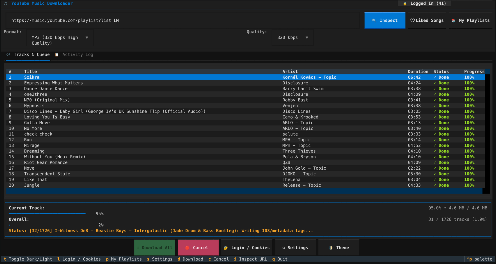
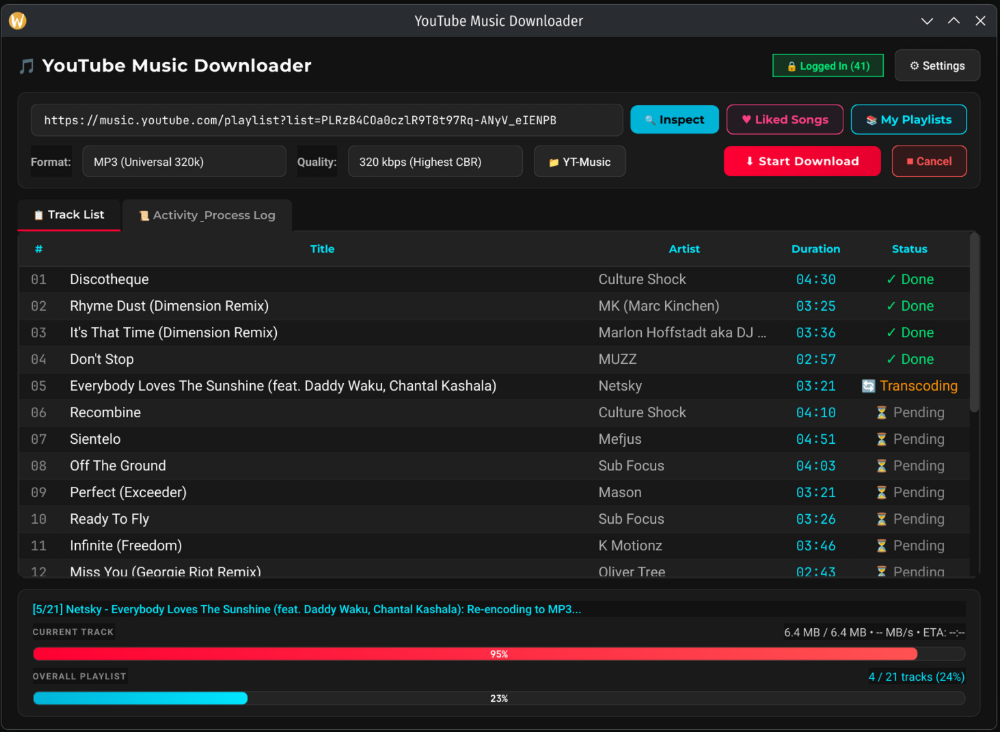

# YouTube Music Downloader

[](https://github.com/tekk/hovnokod-badge)

A cross-platform Terminal User Interface (TUI) application for **macOS**, **Windows**, and **Linux** designed to download YouTube Music playlists and tracks with the highest possible audio quality, supporting browser-based authentication, cookie extraction, and audio re-encoding.

## TUI



## GUI



---

## ✨ Features

- **Cross-Platform**: Runs natively in macOS (Terminal, iTerm2), Linux (Alacritty, Kitty, GNOME Terminal), and Windows (Windows Terminal, PowerShell, CMD).
- **Highest Audio Quality**:
  - Automatically queries and extracts the best available audio streams (`bestaudio/best`), unlocking **256 kbps Opus/AAC** when authenticated with YouTube Music Premium.
  - Option to retain original bitstream (zero quality loss) or re-encode with FFmpeg.
- **Flexible Audio Re-Encoding**:
  - **MP3**: Up to **320 kbps CBR** or VBR 0.
  - **M4A / AAC**: High quality **256 kbps AAC**.
  - **FLAC**: Lossless compression container.
  - **OPUS**: High-efficiency modern codec.
- **Embedded Cover Art & Metadata**:
  - Automatically downloads high-resolution artwork and embeds it into MP3 ID3 tags, M4A mp4-atoms, or Opus tags.
  - Automatically tags Track Title, Artist, Album, Track Number, and Release Year.
- **Interactive Browser Authentication & Cookie Grabber**:
  - **Method 1 (Recommended)**: Opens YouTube Music in an isolated browser window (Chrome, Brave, Edge, Chromium) with DevTools remote debugging. Sign in to your Google Account, and the app automatically captures and saves session cookies into Netscape `cookies.txt` format.
  - **Method 2 (1-Click Sync)**: Direct 1-click cookie sync from already-installed browsers (Google Chrome, Mozilla Firefox, Microsoft Edge, Brave, Opera).
  - **Method 3 (Manual Import)**: Import any existing Netscape `cookies.txt` file.
- **Dark & Light Terminal Background Compatibility**:
  - Built-in theme switching (`textual-dark`, `textual-light`, `nord`, `solarized-light`, `solarized-dark`, `dracula`, etc.).
  - Press `t` or `F2` at any time to toggle between Dark and Light mode.
- **Comprehensive Dual Progress Indicators**:
  - **Current Track Progress Bar**: Live percentage, downloaded/total bytes, download speed (e.g. `3.4 MB/s`), and ETA countdown.
  - **Overall Playlist Progress Bar**: Overall progress, completed track counter (e.g. `12 / 20 tracks`), and percentage.
  - **Live Tracklist Queue**: Interactive data table showing track number, title, artist, duration, and real-time status badges (`⏳ Pending`, `⬇ Downloading`, `🔄 Transcoding`, `✓ Done`, `✗ Error`).
  - **Activity Log**: Dedicated log console displaying real-time download and FFmpeg transcoding output.
- **Automatic Dependency Verification**:
  - Automatically verifies system dependencies (**FFmpeg**, **FFprobe**, and system browsers) on startup.
  - Warns proactively with exact OS-tailored install commands before broken downloads occur.
  - Dedicated CLI diagnostics command (`yt-music-dl --check-deps`) and Desktop GUI **🛠 Dependencies** viewer.

---

## 🚀 Installation & Prerequisites

### Prerequisites
- **Python 3.10+**
- **FFmpeg**: Required for audio extraction, transcoding, and artwork embedding.
  - **macOS**: `brew install ffmpeg`
  - **Linux (Ubuntu/Debian)**: `sudo apt install ffmpeg`
  - **Linux (Arch)**: `sudo pacman -S ffmpeg`
  - **Windows**: `winget install Gyan.FFmpeg` or `choco install ffmpeg`

### Install via pipx (Recommended)
`pipx` runs the app in an isolated environment and adds `yt-music-dl` and `yt-music-gui` to your PATH:

```bash
pipx install yt-music-downloader
# Or install directly from GitHub:
pipx install git+https://github.com/tekk/yt-music-downloader.git
```

### Install via uv
```bash
uv tool install yt-music-downloader
# Or directly from GitHub:
uv tool install git+https://github.com/tekk/yt-music-downloader.git
```

### Standalone Precompiled Binaries
Check the [Latest Releases](https://github.com/tekk/yt-music-downloader/releases) for:
- **Windows x64 / ARM64**: `.zip` with portable `.exe`
- **Linux**: Standalone `.AppImage` (runs on any modern distro)
- **Debian / Ubuntu**: Native `.deb` package

### Install from Source

```bash
git clone https://github.com/tekk/yt-music-downloader.git
cd yt-music-downloader

# Using uv (recommended)
uv venv && uv pip install -e .

# Or using standard venv + pip
python3 -m venv .venv
source .venv/bin/activate  # Windows: .venv\Scripts\activate
pip install -e .
```

---

## 💻 Usage

Run the application:

```bash
yt-music-dl
```

Or run directly with `main.py`:

```bash
python main.py
```

### CLI Arguments

You can pre-load a playlist URL and settings directly from the terminal:

```bash
# Open directly with a playlist URL
yt-music-dl "https://music.youtube.com/playlist?list=PLxxxxxxxxxxxxxxx"

# Set default format and quality
yt-music-dl -f mp3 -q 320

# Specify download directory and custom theme
yt-music-dl -o ~/Music/Albums -t textual-light

# Check system dependencies (FFmpeg, FFprobe, browsers)
yt-music-dl --check-deps

# Show full help
yt-music-dl --help
```

---

## ⌨ Keyboard Shortcuts

| Key | Action |
|-----|--------|
| `t` / `F2` | **Toggle Dark / Light Theme** |
| `i` | **Inspect URL** (fetches and displays playlist tracks) |
| `d` | **Start Download** |
| `c` | **Cancel Download** |
| `l` | **Open Login & Cookie Manager** |
| `s` | **Open Settings** |
| `q` / `Ctrl+Q` | **Quit** |

---

## 🔐 Logging In & Premium Audio

YouTube Music delivers higher bitrate streams (e.g. 256kbps AAC / Opus) and unlocks private playlists ("Liked Music") when authenticated:

1. Press `l` or click the **🔓 Login** badge in the header.
2. Click **🚀 Open Browser & Login**.
3. Sign into your Google account in the opened window.
4. The application automatically detects the login event, grabs session cookies, saves them securely to the application config directory, and updates the header badge to **🔒 Logged In**.
5. Alternatively, use the **📥 Sync from Browser** dropdown if you are already signed into YouTube Music in your daily browser (Chrome, Firefox, Edge, etc.).

---

## 📁 Storage & Configuration Paths

Settings and cookies are stored across OSes in standard user directories via `platformdirs`:
- **Linux**: `~/.config/yt-music-downloader/`
- **macOS**: `~/Library/Application Support/yt-music-downloader/`
- **Windows**: `%APPDATA%\yt-music-downloader\`

Downloaded music defaults to:
- `~/Music/YT-Music/` (or `%USERPROFILE%\Music\YT-Music\` on Windows).
- Each playlist is automatically organized into its own named subfolder with numbered tracks (`01 - Track Name.mp3`).

---

## 🧪 Running Tests

Run the test suite with pytest:

```bash
pytest -v
```

---

## 📄 License

MIT License.
